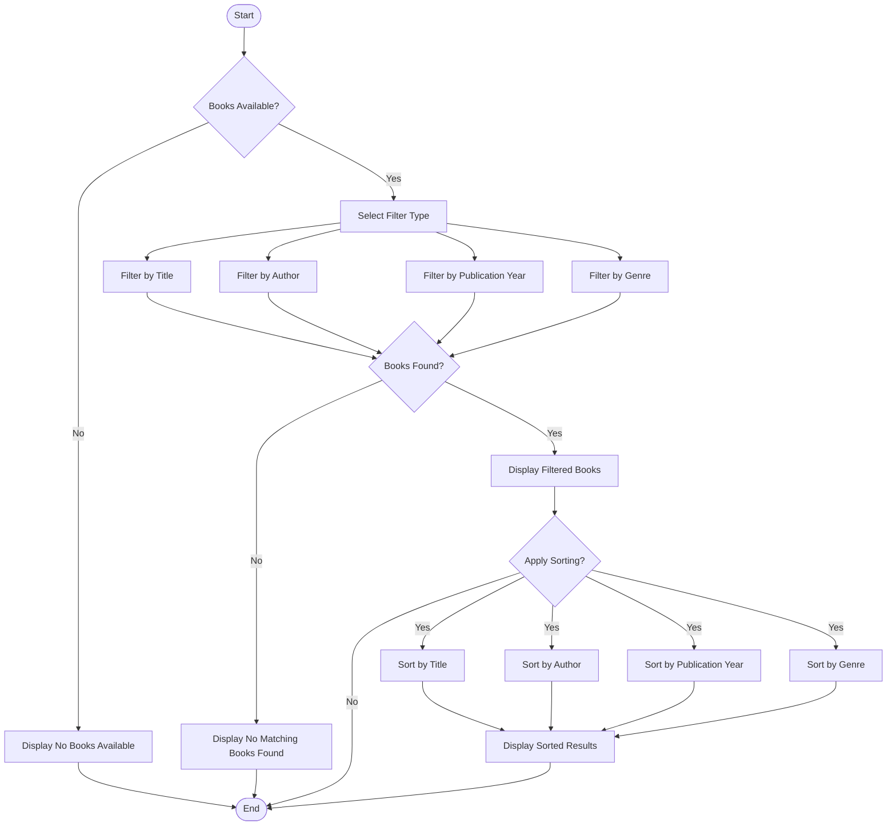
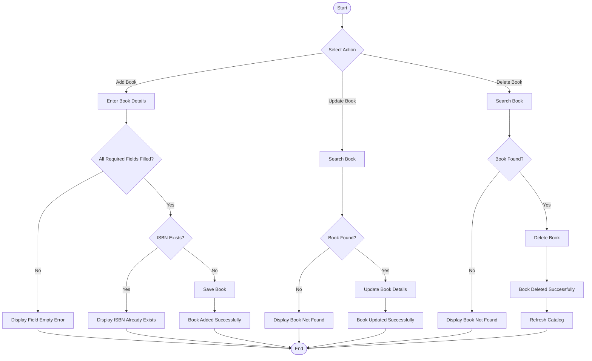
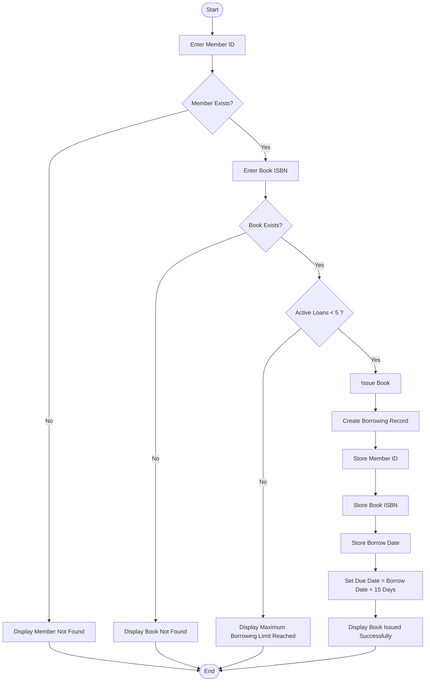

# Library Management System - User Story Flowcharts

## User Story 1: Filter and Sort Books

```mermaid
flowchart TD

Start([Start]) --> A{Books Available?}

A -->|No| B[Display No Books Available]
B --> End([End])

A -->|Yes| C[Select Filter Type]

C --> D[Filter by Title]
C --> E[Filter by Author]
C --> F[Filter by Publication Year]
C --> G[Filter by Genre]

D --> H{Books Found?}
E --> H
F --> H
G --> H

H -->|No| I[Display No Matching Books Found]
I --> End

H -->|Yes| J[Display Filtered Books]

J --> K{Apply Sorting?}

K -->|No| End

K -->|Yes| L[Sort by Title]
K -->|Yes| M[Sort by Author]
K -->|Yes| N[Sort by Publication Year]
K -->|Yes| O[Sort by Genre]

L --> P[Display Sorted Results]
M --> P
N --> P
O --> P

P --> End
```

---

## User Story 2: Manage Books

```mermaid
flowchart TD

Start([Start]) --> A{Select Action}

A -->|Add Book| B[Enter Book Details]

B --> C{All Required Fields Filled?}

C -->|No| D[Display Field Empty Error]
D --> End([End])

C -->|Yes| E{ISBN Exists?}

E -->|Yes| F[Display ISBN Already Exists]
F --> End

E -->|No| G[Save Book]
G --> H[Book Added Successfully]
H --> End

A -->|Update Book| I[Search Book]

I --> J{Book Found?}

J -->|No| K[Display Book Not Found]
K --> End

J -->|Yes| L[Update Book Details]
L --> M[Book Updated Successfully]
M --> End

A -->|Delete Book| N[Search Book]

N --> O{Book Found?}

O -->|No| P[Display Book Not Found]
P --> End

O -->|Yes| Q[Delete Book]
Q --> R[Book Deleted Successfully]

R --> S[Refresh Catalog]

S --> End
```

---

## User Story 3: Issue Books to Members

```mermaid
flowchart TD

Start([Start]) --> A[Enter Member ID]

A --> B{Member Exists?}

B -->|No| C[Display Member Not Found]
C --> End([End])

B -->|Yes| D[Enter Book ISBN]

D --> E{Book Exists?}

E -->|No| F[Display Book Not Found]
F --> End

E -->|Yes| G{Active Loans < 5 ?}

G -->|No| H[Display Maximum Borrowing Limit Reached]
H --> End

G -->|Yes| I[Issue Book]

I --> J[Create Borrowing Record]

J --> K[Store Member ID]
K --> L[Store Book ISBN]
L --> M[Store Borrow Date]
M --> N[Set Due Date = Borrow Date + 15 Days]

N --> O[Display Book Issued Successfully]

O --> End
```
