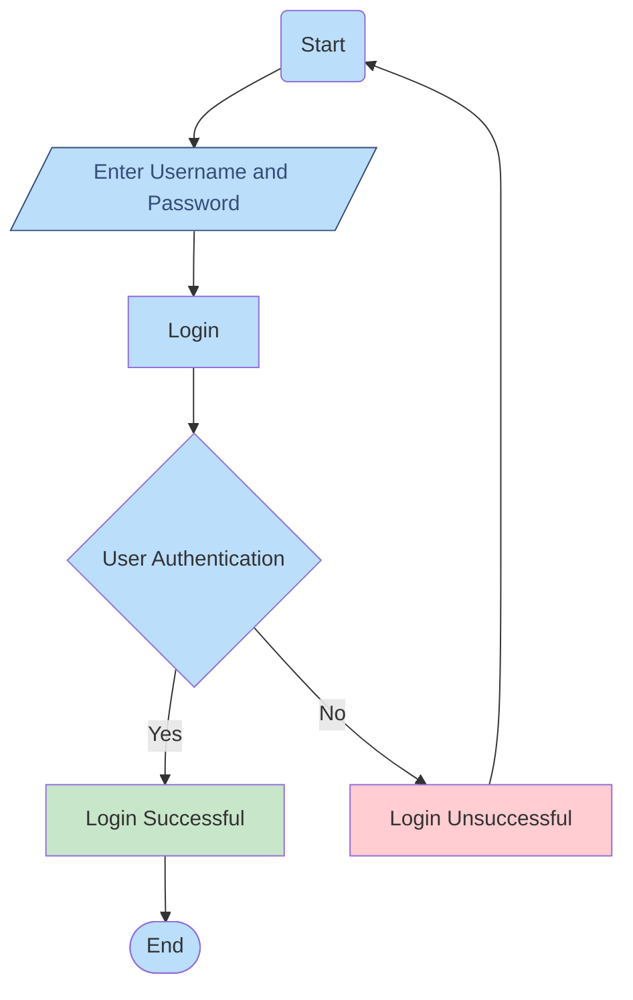
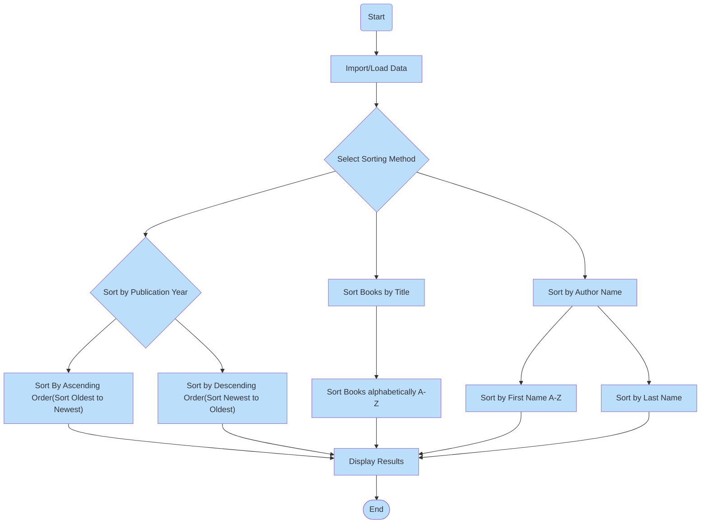

```mermaid
flowchart TB
    A["Start"] -- <br> --> B["Enter Username and Password"]
    B --> C["Login"]
    C --> n1["User Authentication"]
    n1 -- Yes --> D["Login Successful"]
    n1 -- No --> F["Login Unsuccessful"]
    D --> n2(["End"])
    F --> A

    A@{ shape: rounded}
    B@{ shape: lean-r}
    C@{ shape: rect}
    n1@{ shape: diam}
     B:::Sky
    classDef Sky stroke-width:1px, stroke-dasharray:none, stroke:#374D7C, fill:#E2EBFF, color:#374D7C
    style A fill:#BBDEFB
    style B fill:#BBDEFB
    style C fill:#BBDEFB
    style n1 fill:#BBDEFB
    style D fill:#C8E6C9
    style F fill:#FFCDD2
    style n2 fill:#BBDEFB

```

```mermaid
flowchart TB
    A["Start"] --> n2["Import/Load Data"]
    B{"Select Sorting Method"} --> C["Sort Books by Title"] & D["Sort by Publication Year"] & n1["Sort by Author Name"]
    n2 --> B
    C --> n3["Sort Books alphabetically A-Z"]
    D --> n4["Sort By Ascending Order(Sort Oldest to Newest)"] & n5["Sort by Descending Order(Sort Newest to Oldest)"]
    n8["Display Results"] --> n7(["End"])
    n4 --> n8
    n5 --> n8
    n1 --> n10["Sort by First Name A-Z"] & n11["Sort by Last Name"]
    n3 --> n8
    n10 --> n8
    n11 --> n8

    A@{ shape: rounded}
    n2@{ shape: rect}
    D@{ shape: diam}
    n1@{ shape: rect}
    n3@{ shape: rect}
    n4@{ shape: rect}
    n5@{ shape: rect}
    n8@{ shape: rect}
    n10@{ shape: rect}
    n11@{ shape: rect}
    style A fill:#BBDEFB
    style n2 fill:#BBDEFB
    style B fill:#BBDEFB
    style C fill:#BBDEFB
    style D fill:#BBDEFB
    style n1 fill:#BBDEFB
    style n3 fill:#BBDEFB
    style n4 fill:#BBDEFB
    style n5 fill:#BBDEFB
    style n8 fill:#BBDEFB
    style n7 fill:#BBDEFB
    style n10 fill:#BBDEFB
    style n11 fill:#BBDEFB
```
