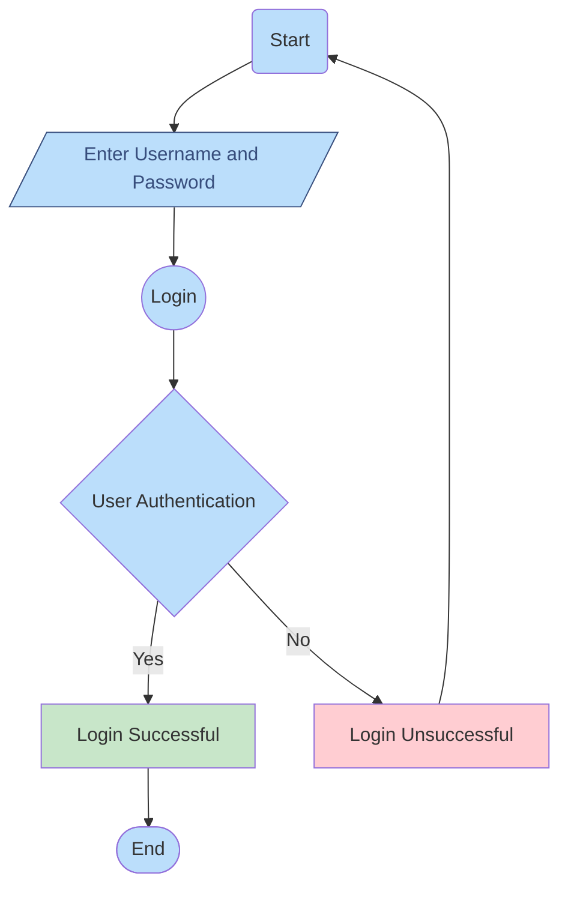

```mermaid
flowchart TD
    A["Start"] -- <br> --> B["Enter Username and Password"]
    B --> C(("Login"))
    C --> n1["User Authentication"]
    n1 -- Yes --> D["Login Successful"]
    n1 -- No --> F["Login Unsuccessful"]
    D --> n2(["End"])
    F --> A

    A@{ shape: rounded}
    B@{ shape: lean-r}
    n1@{ shape: diam}
     B:::Sky
    classDef Sky stroke-width:1px, stroke-dasharray:none, stroke:#374D7C, fill:#E2EBFF, color:#374D7C
    style A fill:#BBDEFB
    style B fill:#BBDEFB
    style C fill:#BBDEFB
    style n1 fill:#BBDEFB
    style D fill:#C8E6C9
    style F fill:#FFCDD2
    style n2 fill:#BBDEFB

```
